<div align="center">

# Glass Box

See what Claude actually does under the hood, one clickable step at a time.

[![Live][badge-site]][url-site]
[![HTML5][badge-html]][url-html]
[![CSS3][badge-css]][url-css]
[![JavaScript][badge-js]][url-js]
[![Claude Code][badge-claude]][url-claude]
[![License][badge-license]](LICENSE)

[badge-site]:    https://img.shields.io/badge/live_site-0063e5?style=for-the-badge&logo=googlechrome&logoColor=white
[badge-html]:    https://img.shields.io/badge/HTML5-E34F26?style=for-the-badge&logo=html5&logoColor=white
[badge-css]:     https://img.shields.io/badge/CSS3-1572B6?style=for-the-badge&logo=css3&logoColor=white
[badge-js]:      https://img.shields.io/badge/JavaScript-F7DF1E?style=for-the-badge&logo=javascript&logoColor=black
[badge-claude]:  https://img.shields.io/badge/Claude_Code-CC785C?style=for-the-badge&logo=anthropic&logoColor=white
[badge-license]: https://img.shields.io/badge/license-MIT-404040?style=for-the-badge

[url-site]:   https://glassbox.neorgon.com/
[url-html]:   #
[url-css]:    #
[url-js]:     #
[url-claude]: https://claude.ai/code

</div>

---

## Overview

Glass Box turns the hidden machinery of Claude into something you can click through. One line like "spin up subagents to review my writing" becomes a live diagram of the coordinator, the `Task` tool, and the isolated subagents underneath, replayed step by step with the raw API turns beside them.

It is study fuel for the Claude Certified Architect &mdash; Foundations exam: eleven interactive labs, exam-accurate language, a level-by-level Agent SDK build, a playbook of the decision patterns that settle most questions, and a bank of **96 scenario questions** you can drill and score.

Every run is a hand-authored simulation, not a live API call, so it runs entirely in your browser with no keys and no setup.

**Live:** glassbox.neorgon.com

---

## Labs

**See the machinery**

- **Agent Loop** -- replay a run node by node. Click a node to inspect its model, `allowed_tools`, `tool_choice`, and context; drag it aside; toggle "what you see" vs "under the hood" API turns while a context-window meter fills.
- **Agent SDK** -- the loop lab shows what Claude Code already does; this is the part you write. Six levels, each adding exactly one layer: a bare stateless call, then tools and the `stop_reason` loop, `AgentDefinition`, hooks, subagents via `Task`, and sessions. Every level lists what it buys you, what still breaks if you stop there, and its caveats. Then a **config bench**: pick what the agent has to do (issues refunds, must parse as JSON, reads third-party MCP tools), set the knobs, and the console reports which requirements are merely *requested* rather than *guaranteed*.
- **MCP** -- run the same task two ways: improvise an integration (burns tokens on throwaway code) vs a defined MCP server (auto-discovered tools), metered side by side, plus the structured vs generic `isError` contract.
- **Config Explorer** -- step a repo from bare to fully outfitted (`CLAUDE.md`, `AGENTS.md`, `.claude/rules/`, skills, hooks, `.mcp.json`) in a VS Code-style tree; each file is annotated with what it changes.
- **Plan vs Direct** -- a console that auto-decides planning mode vs direct execution from the guide's signals, with preset scenarios.
- **Context** -- the same conversation replayed under different memory strategies (sliding window, rolling digest, CASE FACTS + digest + recent, breakpoint reinforcement, prefill), split-screen: the chat both sides see vs the request the model actually receives. Watch a window drop the order number, a digest blur `$129.99` into "roughly $130", a persona drift and its catchphrase feed back &mdash; then a technique matrix and a symptom&rarr;cause&rarr;fix gallery.

**Answer the questions**

- **Playbook** -- the exam brief (format, domain weights, what is explicitly out of scope) and the 21 recurring decision patterns. Each opens to the tell in the stem, the shape of the correct option, and the distractor shapes to reject, with the guide questions it decides.
- **Lexicon** -- the exam's operational vocabulary decoded: *synthesize* &ne; *aggregate* &ne; *consolidate*. 22 verb cards grouped by family (each with its stem-tell and the trap built on it), a ten-second test for the combination verbs, and the near-synonym pairs split by the one difference that decides the question.
- **Traps** -- three catalogues. *Distractor lures*: answer shapes that read as senior engineering and lose here, each with the case where it is genuinely right. *Near-miss pairs*: stems that look identical until one word moves the answer, with the discriminator stated. *Before you answer*: a pre-answer routine.
- **Anti-patterns** -- a flip-card gallery of the traps the exam loves, cross-referenced by the live flags in the other labs.
- **Drill** -- 96 questions in the exam's own format. Filter by scenario, weighted domain or difficulty; every answer returns the reasoning for the winner *and* for each option you rejected; the result screen gives a domain-weighted score estimate, groups your misses by the pattern behind them, and reopens any of them in full. It also remembers: the setup screen shows rolling per-domain accuracy across your last runs, with one button that drills your two weakest domains and one that retries the questions you have not got right yet. A run you walk away from is waiting where you left it. Nothing leaves the browser, and **Forget history** clears it.
- **Portable bank** -- the whole bank exports to [Proctor](https://proctor.neorgon.com/)'s format ([`proctor-drill.json`](proctor-drill.json), regenerated with `make proctor`) and runs embedded on the overview -- study mode, timed simulator, PDF export, notes.

### About the question bank

Q1&ndash;Q76 follow the official guide's practice test. The guide lists eight exam scenarios but only exercises five of them, so **Structured Data Extraction** and **Developer Productivity Tools** are written here in the same format from the guide's theory chapters &mdash; those chips are marked with a `+`. Every question carries its source, and no answer asserts behaviour the guide does not state.

---

## Keyboard shortcuts

- **0&ndash;9**, **C**, **V** -- jump to a lab (0 is the overview, C the Context lab, V the Lexicon)
- **1&ndash;4** or **A&ndash;D** -- answer the current drill question (the drill claims the digits while running)
- **Enter** / **N** -- next question, once the answer is revealed
- **Esc** -- close the node inspector
- **Exam mode** (header) -- surface the precise certification terms with glossary tooltips, and expand every playbook pattern

---

## Running locally

ES modules require an HTTP server (not `file://`):

```bash
make serve   # http://localhost:8856
# or
python3 -m http.server 8856
```

---

## Architecture



```
glassbox-site/
├── index.html              # App shell: header, lab rail, mount points, inspector, footer
├── css/
│   └── style.css           # Design tokens + all lab styles (clay accent)
├── js/
│   ├── app.js              # Entry point
│   ├── state.js            # Active lab + exam mode (localStorage)
│   ├── render.js           # Shell render + lab router
│   ├── events.js           # Rail, exam toggle, keyboard, hash nav
│   ├── ui.js               # Inspector drawer + glossary tooltips
│   ├── tips.js             # Glossary definitions (hover tips)
│   ├── utils.js            # escHtml, highlightCode, toast, copy
│   ├── history.js          # Drill run log: rolling accuracy, weakest domains
│   ├── data/               # Hand-authored content (pure data, no DOM)
│   │   ├── runs.js         #   agent-loop scenarios
│   │   ├── loop-contrast.js#   steer-with-prompt vs enforce-in-code
│   │   ├── mcp.js          #   improvised vs defined MCP
│   │   ├── config.js       #   repo maturity levels + user scope
│   │   ├── planning.js     #   plan-vs-direct signals + cases
│   │   ├── context.js      #   conversation-memory playouts + technique matrix
│   │   ├── antipatterns.js #   anti-pattern gallery + inline flags
│   │   ├── sdk.js          #   L0→L5 build-up: code, keys, caveats
│   │   ├── sdk-config.js   #   config bench: knobs, requirements, notes
│   │   ├── exam-brief.js   #   format, scoring, domain weights, out of scope
│   │   ├── patterns.js     #   the 21 answer patterns + their groups
│   │   ├── traps/          #   lures, near-miss pairs, pre-answer checks
│   │   ├── vocab.js        #   the exam's verbs: mechanisms, tells, traps
│   │   └── questions/      #   question bank, one file per exam scenario
│   │       ├── index.js    #     aggregate + scenario/domain/level vocabularies
│   │       └── …           #     support, codegen, research, ci, conversational, authored
│   └── labs/               # One module per lab (mount(root))
│       ├── loop.js         #   the agentic-loop terminal
│       ├── sdk.js          #   level stepper + config bench
│       ├── mcp.js
│       ├── config.js
│       ├── planning.js
│       ├── context.js      #   conversation memory, split-screen
│       ├── patterns.js
│       ├── vocab.js        #   the Lexicon: verb cards + distinction pairs
│       ├── traps.js
│       ├── antipatterns.js
│       ├── drill.js        #   question engine + scoring + miss review
│       └── drill-recall.js #   the drill's "Since last time" card
└── docs/architecture.mmd   # Mermaid source for the diagram above
```

---

<div align="center">
<sub>Part of <a href="https://neorgon.com/">Neorgon</a></sub>
</div>
